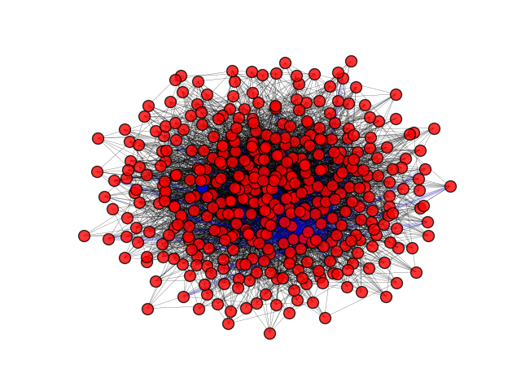
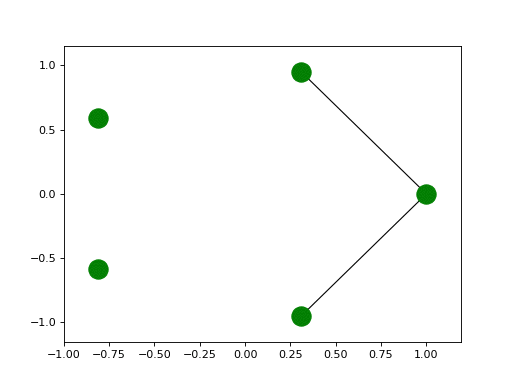
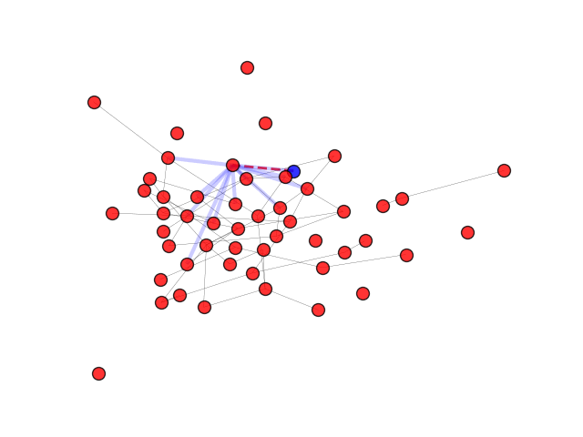
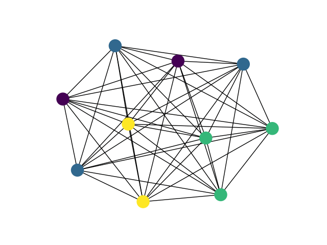
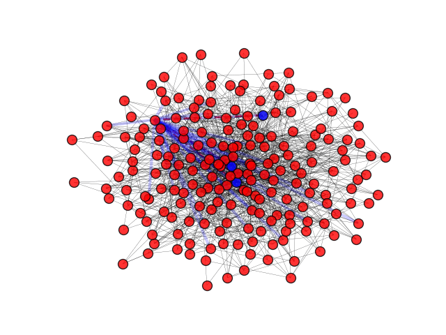

# La diffusion des mèmes parmi les reseaux sociaux

> **Quels critères influencent la visibilité d'un même?**

## Le mème

L’intéret commun pour la mémétique et les mots de Richard Dawkins ont
formé le trinome auteur de ce document. Il se propose d'analyser et
comprendre l’interaction des mèmes sur internet et en particulier sur
les réseaux sociaux. Pour arriver à cet objectif nous avons développé
nos dossiers personnels en se rapprochant de l’argument, puis nous avons
parcouru le sujet de la mémétique selon la méthode de l’OLMDP pour en
comprendre l’ensemble, et conclure sur la spécificité des réseaux.

### Recherche bibliographique

* [Documentation sur le mème](doc.md)
* [Les lieux du mème](lieux.md)
* [Métiers et disciplines liées au mème](metiers.md)

Dans toutes les disciplines, la recherche documentaire, bibliographique n'est pas chose simple. Les sources d'information sont nombreuses, multiples. En dresser la liste est quasiment impossible. De plus, l'information devient tres vite inutilisable en fonction du temps. Elle se perime rapidement.
C'est pour celà qu'il faut avoir un interet du sujet ( les mèmes ). Dans une demarche documentaire, nous devons d'abord definir le champ de recherche, c'est à dire le domaine intellectuel dans lequel elle  va s'exercer. Par exemple le meme va t -il se diffuser que dans un domaine en particulier, ou bien dans plusieurs domaines mais en meme temps ? Il faut en tenir compte dans notre recherche.

Dans le cas du mème, il existe plusieurs type de documents. Le document primaire désigne tout document original n'ayant subi aucune transformation comme les articles de periodiques, des livres, des peintures, des gravures, et tout objets ou instruments sources d'information.

* [Études dans ce champ](dejafait.md)

### Travail preliminaire

Le mème est un objet fascinant dont on semble connaitre le
fonctionnement, bien que celui demeure néanmoins difficile a reproduire
« artificiellement » car imprévisible. Par ailleurs, aux vu des enjeux
naissant autour de cet objet ; la plupart des métiers vont venir éclaircir
ces problématiques dans les années à venir.

### Hypothèses

***Il y a des mèmes qui ont plus de facilité à survivre et à se diffuser.***

* différents réseaux ont des vitesses de diffusion différentes
* un mème réussit est forcement diffusé par la diffusion d'un compte important
* un mème contenant une choix A ou B a plus tendance à être diffusé
* en fonction du pays, un reseaux est plus visible que les autres

### Formulation de la question

La formulation de la question doit dans la plupart du temps être formulé par ses propres mots. Cependant, même si l'objectif est formulé selon nos propres mots ; il est important d'avoir une liste d'informations ; une liste de termes retenus et non exhaustive.

### Critères d'évaluation

En general, un critère permet d'apprecier le degré d'atteinte des resultats, des objectifs.
Ce sont les reperes que l'on choisit pour servir de base à notre jugement. Ils precisent ce que l'on attend, sur quel aspect va porter notre jugement.
La liste des criteres pourrait etre grande, c'est à l'équipe de choisir ce qui est important pour elle, ce qu'elle attend plus précisemment comme prise de conscience, comme responsabilisation, comme amelioration.

### Les indicateurs

Ce sont les signes qui témoignent de l'existence d'un phénomène, d'un effet.
Ils sont observables, concrets et constituent les données que l'on va recueillir. Ils sont quantitatifs ou qualitatifs.

Encore une fois, il est necessaire de faire un choix parmi l'ensemble des indicateurs qu'il serait possible de prendre en compte.

L'indicateur doit aussi être choisi en fonction des parametres suivants.
    .Va-t-on pouvoir receuillir les données facilement ( en termes de competence pour faire ce recueil, de temps disponible, de moyens financiers...)?
    .Est-ce que recueillir cette information pourrait gêner les personnes.

Pour un même critere, il est possible de retenir un ou plusieurs indicateurs.

### Question à se poser

* *Que vais-je observer ?*
* *Receuillir cette information me permettra t- elle de dire qu'il y aura une distribution de telle chose ou telle chose ?*
* *Comment recueillir l'expression des signes de difficulté à suivre un traitement ?*
* *Concretement, quelles observations me montrera les iniatitives chez ce groupe de femmes ?*

Une cohérence est indispensable entre les objectifs, les strategies et les criteres d'evaluations.

#### Champ d'investigation et d'étude

La memetique est une approche transdisciplinaire qui prend le parti d'etendre le vivant au-delà du strict règne biologique. Celà signifie que le mème etend la notion de "vivant" à tout ce qui constitue la sphere d'activité humaine, notamment les techniques et les idées.

### Outils d'evaluations

Ils permettent le recueil des données.
Attention, il ne faut pas les confondre avec les outils pédagogiques.
Il est préferable de construire ses propres outils car ils seront davantage adaptés aux indicateurs précis qui ont été choisis pour ce projet et qui correspondent aux attendes de l'équipe.

### Exemple - le Microblog

Comme son nom l'indique, il s'agit d'un derivé concis du blog web ou d'un web social. Cette idée a été developpé aux Etats-Unis en 2006. Le Microblog permet des publications beaucoup plus courtes que dans les blogs classiques
L'objectif des Microblog est de diffuser plus fréquemment des informations en se limetant ; a du contenu utile, à mi-chemin entre messageries instantanée et blogs.
Comme les blogs, ils autorisent un archivage web ; et comme les messagerie instantanée ( messenger ) ils permettent la diffusion en temps reel des informations jugées pertinentes par leurs editeurs.

### Les services de microblogage

Twitter est un service de microblogage le plus connu en Occident avec 241 millions d'utilisateurs en 2013.
Evidemment, nous avons d'autres services tels que Identica.ca, Hello, Jaiku ( qui ont été racheté par Google Inc en 2007),Soup, Tumblr, Yammer,Sina Weibo, Tencent Weibo ( 623 millions d'utilisateurs ).
Facebook a developpé son propre service de microblogage.

### Objectif

***Évaluer les critères de réussite d'un mème sur les réseaux sociaux et en modéliser la diffusion dans un environnement restreint.***

### Exemples d'objectifs

Par exemple, ameliorer la communication entre jeunes et adultes de la communauté éducative du lycée. Les tendances des élèves aux lycées prennent souvent le dessus.C'est une mode qui se diffuse, les tendances des jeunes.

**Les critères dans ce cas** : Par exemple, diminuer cette tendance de l'insolence" envers les adultes ou les professeurs.

**Indicateurs de cette tendance** : Nombre d'avertisement pour l'insolence avant et après l'action, l'acte.

**Outils utilisées** : grille de suivi par exemple.

La tendance chez les jeunes à conduire sans casque, l'utilisation de la moto au lieu de la voiture.

**Objectifs dans ce cas là** : la capacité de prendre une decision adaptée au risque.

**Outils d'evaluations** : Par exemple, une echelle d'attitude sur la personne concernée.

## Modélisation

Modéliser l'integrité d'un réseau social avec toutes les variables à tenir en compte est impossible car il demanderait une puissance de calcul en dehors des capacités de la pluspart des ordinateurs.
Pour cette raison le modèle est constitué d'une façon simplifiée, contient un réseau restreint avec un calcul maximale sur un groupe de 500-700 personnes. Les amitiés sont réciproques, du coup il n'existe pas le concept de "follow": s'il y a une amitié entre A et B, les informations voyagent dans les deux sens.

De plus, chaque liaison est marquée par un poids qui peut varier de 0 à 1 et indique la proximité des deux individus, c'est à dire la probabilité et la fréquence des transitions des mèmes entre eux. Pour ce qui concerne les graphes on a choisi de représenter par un trait gris seulement les liaisons les plus fortes afin de maintenir la propreté et la facilité d'analyse.

Ensuite, un point critique a été le phenomnène de retour du mème à quelqu'un qui l'avait déjà: on a choisi d'avoir une probabilité de perdre le mème une fois qu'il le possède. Cela correspond dans la réalité d'une perte d'interêt du mème. Une fois que quelqu'un a perdu le mème, il n'aura plus la possibilté de le reprendre dans le cas où il le recoit une nouvelle fois . Cela s'eloigne de la réalité, mais prendre en compte ce facteur nous obligerait à augmenter à la puissance 10 la quantité de nos calculs.

> Représentation d'un mème dans un network avec 400 personnes.

Ici, il y a une simulation effectuée sur un network de 400 personne ? Il est intéressant d'étudier la position des "nodes" autour du graphe.
Les nodes qui sont au centre, correspondent à ceux qui ont le plus de liaisons avec le plus d'individus ; et les nodes externes sont ceux qui sont "pauvres" d'amitiés.

Il est intéressant de noter qu'il y a des liaisons qui deviennent rouges l'espace d'une frame, cela veut dire qu'il y a eu un passage d'information entre les deux nodes.

### Code

La partie de code a été divisée en trois grandes problématiques, ce qui correspond après à la subdivision en modules du programme:

* Creation d'un network qui soit manipulable et représentable
* Insertion d'un mème dans le network et donner des lois de diffusions
* Assemblage des parties avec une facilité de changer les variables

Même si nous n'avons pas utilisé Jupyter Notebook pour coder et rédiger notre projet, nous avons appuyé le code sur l'environnement Anaconda.
Par conséquent, nous avons utilisés les librairies de numpy, matplotlib (en particulièr pyplot et animaton) et seaborn.

#### Network

[Code relatif](code/network.md)

La formation d'une structure pour le network a été largement facilité par l'introduction de la librairie networkx qui permet de former un network adapté à simuler un réseau social en peu de lignes.

Même si la mise en place d'un réseaux a été assez vite, la comprehension des fonctions fournies par la librairie, ont été utilisées pour la gestion du mème, a pris plus de temps.

Enfin, l'implémentation de networkx a été un grand plus pour le projet car il a permis de représenter visuellement les données calculées en forme de listes par le programme.

> Représentation d'un mème dans un network avec 50 personnes.

#### Mème

[Code relatif](code/ges_meme.md)

Le mème est manipulé comme un "attribute" des nodes qui ont, ou pas, le mème. Le cas positif ouvre la possibilité d'envoyer le mème aux individus avec laquelle il a une liaison selon la loi de probabilité définie sur les edges (càd les liaisons).

De plus, nous avons ajouté l'attribute "dégoût" qui détermine *a priori* des gens qui n'aimerons pas le mème et donc ne le retiendrons jamais.
Cet attribute s'applique aussi *a posteriori* aux nodes qui detiennent le mème et qui sont peut être en train de le partager. De cette façon quelqu'un qui a déjà vu/imité le mème tendra avec le temps à ne plus s'identifier avec le groupe des gens ayant le mème.

Enfin, pour suivre graphiquement la diffusion du mème sur le réseaux, on a choisi de marquer en rouge les edges ou il y a un passage entre deux nodes. Cette fonction permet en plus de visualiser grossièrement la popularité d'un mème car beaucoup ou pas partagé.

### Finalisation

[Code relatif](code/manager.md)

Composer les deux "modules" du code a été relativement facile surtout car les deux marchaient déjà enseble dans la phase de production. Globalement cela a permis de visualiser avec les graphes même en construisant des animations les données élaborées par le module 'mèmes' lequel s'appuyait bien sur la librairie NetworkX.

## Analyse

Tableau statistique:

A l'aide de compteurs nous avons calculé les probabilté de présence du même.
Nous avons utilisé 12 cas de figures différents en regardant 4 variables à chaque fois.
La première ligne correspond aux nombres d'utilisateurs du network.
La première colonne correspond à la probabilité de rétissence du même.
Enfin pour des resultats plus précis nous avons fait 20 simulations par cas pour que l'échantionnage de probabilité soit suffisant.

Voici nos résultats:

Ci dessous le tableau de probabilité révélant si le même a persisité plus de 20 générations.

♠| 50 | 100 | 200 | 400
--------| ---| ----| ----| ---
0.2 | 10% | 20% | 50% | 65%
0.3 | 5% | 10% | 30% | 45%
0.5 | 0% | 5% | 15% | 30%
 
Ci dessous on a calculé la probabilité que le même atteigne 70% de diffusion.
C'est à dire que 70% de la population du network on visionné le même.

♣| 50 | 100 | 200 | 400
--------| ---| ----| ----| ---
0.2 | 15% | 25% | 40% | 55%
0.3 | 5% | 15% | 35% | 45%
0.5 | 0% | 5% | 15% | 25%

Ci dessous, la probabilité qu'un même revienne à son expéditeur.
C'est a dire qu'au bout d'au moins trois générations le même ait fait une boucle d'expéditeur à expéditeur.

♥| 50 | 100 | 200 | 400
-------| ---| ----| ----| ---
0.2 | 25% | 65% | 90% | 98%
0.3 | 15% | 45% | 75% | 95%
0.5 | 5% | 35% | 65% | 80%

Ci dessous on a calculé le nombre de génération ou le même a atteint 40%  diffusion.
On a, toujours a l'aide de compteur trouvé la vitesse de diffusion du même.
Enfin on a pris la moyenne des 20 essais.
Si la cellule contient N/A c'est que le même n'a pas atteint suffisament de fois 50% pour qu'on juge de sa vitesse de diffusion.  

   ♦ | 50 | 100 | 200 | 400
-----------| ---| ----| ----| ---
0.2 | 7.23 | 9.12 | 9.45 | 8.36
0.3 | 8.76 | 11.13 | 12.14 | 11.85
0.5 | N/A | 11.89 | 14.39 | 13.45

Ces 4 tableaux révèlent plusieurs comportements du réseaux social. 
En effet la large diffusion est compliqué contrairement a la rapidité de l'information. 
Un même transmis dans un plus grand network sera plus vu car plus facilement partagé et plus il est partagé plus il survivra longtemps.
Il se passe excatement l'inverse pour les petits networks.
Nous avons aussi remarqué pendant nos différentes simulations que des petits groupes se forment sur les grands réseaux.
Cela fonctionne comme les groupes sur les vrais réseaux sociaux ou des liens forts se forment entre les utilisateurs.
Dans ce cas de figure le même persiste dans ces groupes et a du mal a en sortir. Il tourne en cercle fermé.
Enfin certaine de nos simulation (avec une probabilté de rétissence de moins de 0.15) n'avais pas de fin et l'intégralité du network avait eu acces au même.
Et les simulations avec une rétissence de plus 0.5 etait inexploitable car le même ne voyageais pas du tout.

> Représentation d'un mème dans un network avec 200 personnes.

Enfin voici les critères de réussite du même:

* *"Temps de compréhension"* : Image + 1 ligne de texte a une diffusion bien supérieur à un pavé de texte.
* *"Une accroche"* : si un même plait c'est qu'il est visible. L'utilisation d'hashtags, d'une image ou des phrases accrocheuses augmente cette visibilité.
* *"Les questions rétorique"* : elles permettent de faire participé l'utilisateur, donc le même sera plus facilement partagé.
* *"Private Joke"* : un même très spécifique peut déplaire. En effet on ne comprendra pas le même d'origine inconnue. Exemple: une personne qui n'a jamais vu star wars ne comprendra pas le "que la force soit avec toi". Par contre ce même peut devenir très populaire pour la population ayant connaissance du support mais aura tendence à circuler en cercle fermé.
* *"L'origine"* : La personne à lancer le même est très importante pour qu'un même réussisse. Une personnalité médiatisé aura un impacte plus direct et important qu'une personne lamda. (par exemple les expressions reprises de personnalitée : le "non mais alo quoi" de Nabilla en 2013).
* *"La chance"* : la diffusion d'un même est chaotique donc on ne peut pas savoir ce qui marchera ou pas. De plus si un autre même surplombe le votre, celui-ci passera inaperçu.

## Conclusion

Les 3 hypotheses :

1. ***Différents réseaux sociaux ont des vitesses de diffusion différentes.***

Les réseaux sociaux amis-amis tels que facebook ont une diffusion très lente.
En effet pour facebook tout vos amis ne recoivent pas vos publications, de plus seul vos amis peuvent voir vos publications. Donc le champs de diffusion est très restreint. Le principale avantage de facebook pour la diffusion de même est sa très grande popularité. En effet le nombre d'utilisateur de facebook est bien plus important que twitter qui est son principale concurent.
Prenons l'exemple de twitter. twitter a une diffusion bien plus rapide que celle de facebook. Tout provient de son système interne. En effet le système de retweet permet une diffusion sur tout tes "follower". plus vous êtès suivit plus vos chances d'être retweeter sont importants et plus votre même sera visible.  

2. ***Un même réussit est forcement diffuser par un compte important.***

Vrai et faux. En effet si le même débute d'un gros compte il aura beaucoup plus de chance d'être partager, mais la diffusion d'un même étant chaotique une personne peut lancer un même avec un petit compte. 

3. ***Un même contenant un choix A et B a plus tendance à être diffuser.***

Lorsque le choix de l'utilisateur est mis en jeu son partage est plus important. Mais si le design du choix est mauvais l'utilisateur aura tendance a l'ignoré.

> **[Bibliographie](bibl.md)**
